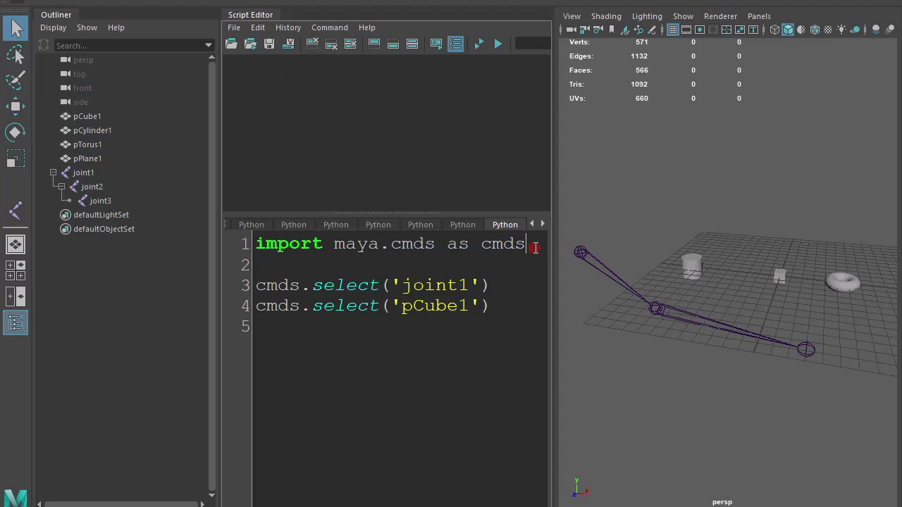

# Maya 常用功能例文

以下例文均以[Python3语法](https://docs.python.org/zh-cn/3/whatsnew/3.0.html)编写。

[Maya中的Python](https://knowledge.autodesk.com/zh-hans/support/maya/downloads/caas/CloudHelp/cloudhelp/2019/CHS/Maya-Scripting/files/GUID-C0F27A50-3DD6-454C-A4D1-9E3C44B3C990-htm.html)是什么？

## 导入模块
以下例文都会使用到maya.cmds模块。所以，开头必须导入maya.cmds模块。
```python
import maya.cmds as cmds
```

## 选择物体

[cmds.select的说明文档](https://help.autodesk.com/cloudhelp/2020/CHS/Maya-Tech-Docs/CommandsPython/select.html)

### 选择单个物体

```python
cmds.select('joint1')
cmds.select('pCube1')
```



### 同时选择多个物体
```python
cmds.select('joint1', 'pCube1')
cmds.select(['joint1', 'pCube1'])
```

### 加选1个或多个物体
```python
cmds.select('joint1')
cmds.select('joint2', add=True)
cmds.select('joint3', add=True)
cmds.select('pCube1', add=True)
cmds.select('pTorus1', add=True)
```

```python
cmds.select('joint1')
for i in ['joint2','joint3','pCube1','pTorus1']:
    cmds.select(i, add=True)
```

### 解除当前选择物体

```python
cmds.select(cl=True)
```