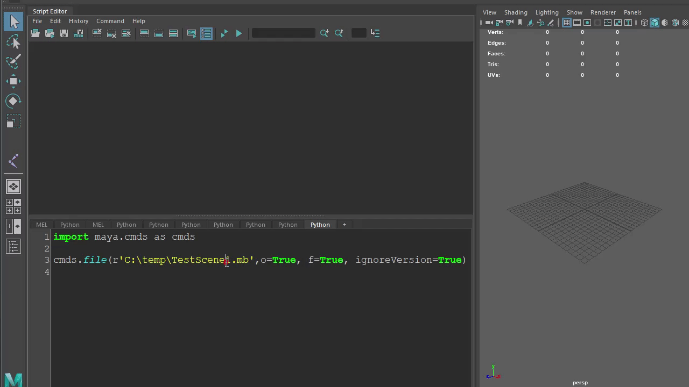
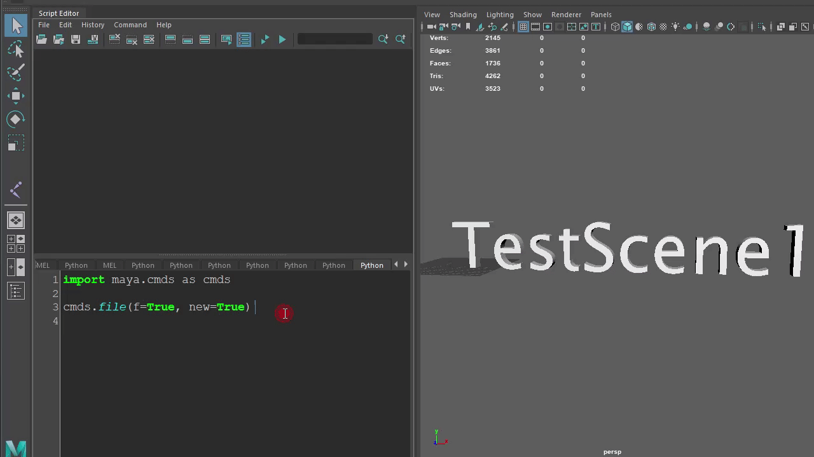

# Maya python例文参照(入门)

所使用环境为Maya2019，为了兼容[Maya2022](https://knowledge.autodesk.com/zh-hans/support/maya/learn-explore/caas/CloudHelp/cloudhelp/2022/CHS/Maya-ReleaseNotes/files/Maya-ReleaseNotes-2022-release-notes-html-html.html)以及之后的版本。
以下例文均以[Python3语法](https://docs.python.org/zh-cn/3/whatsnew/3.0.html)编写。
书写风格为[pep8](https://peps.python.org/pep-0008/)。

点击导航栏可以搜索或者直接定位到想看的内容。


## 常见Q&A
> Q: 为什么在一些特定的字符串前面需要加`r`

原始字符串 - 原始字符串：所有的字符串都是直接按照字面的意思来使用，没有转义特殊或不能打印的字符。 原始字符串除在字符串的第一个引号前加上字母 r（可以大小写）以外，与普通字符串有着几乎完全相同的语法。

[例文和参照等](../python/resources/string.md#操作符 r)

[更多内容字符串相关内容](https://www.runoob.com/python3/python3-string.html)

> Q: Maya中的Python

答案在[这里](https://knowledge.autodesk.com/zh-hans/support/maya/downloads/caas/CloudHelp/cloudhelp/2019/CHS/Maya-Scripting/files/GUID-C0F27A50-3DD6-454C-A4D1-9E3C44B3C990-htm.html)

## 导入模块 [import](https://docs.python.org/zh-cn/3/reference/import.html)
以下例文都会使用到[maya.cmds](https://help.autodesk.com/view/MAYAUL/2019/ENU/?guid=__Commands_index_html)模块。

```python
import maya.cmds as cmds
```

## 文件 [cmds.file](https://help.autodesk.com/cloudhelp/2019/ENU/Maya-Tech-Docs/Commands/file.html)

### 打开一个maya文件
```python
cmds.file(r'C:\temp\TestScene1.mb',o=True, f=True, ignoreVersion=True)
```
结果
```python
# File read in  0.097 seconds. # 
# Result: C:/temp/TestScene1.mb # 
```


### 新建场景 (New Scene)
```python
cmds.file(f=True, new=True)
```
结果
```python
# Result: untitled #
```



### 将场景另存为 (Save Scene As..)
```python
cmds.file(rename=r'C:/temp/bb1.mb')
cmds.file(save=True, f=True)
```

## 选择节点 [cmds.select](https://help.autodesk.com/cloudhelp/2020/CHS/Maya-Tech-Docs/CommandsPython/select.html)

### 选择单个节点
```python
cmds.select('joint1')
cmds.select('pCube1')
```


### 同时选择多个节点
```python
cmds.select('joint1', 'pCube1')
cmds.select(['joint1', 'pCube1'])
```

### 加选1个或多个节点
```python
cmds.select('joint1')
cmds.select('joint2', add=True)
cmds.select('joint3', add=True)
cmds.select('pCube1', add=True)
cmds.select('pTorus1', add=True)
```


```python
cmds.select('joint1')
for i in ['joint2','joint3','pCube1','pTorus1']:
    cmds.select(i, add=True)
```

### 解除当前选择节点

```python
cmds.select(cl=True)
```


## 查询节点的类型 [cmds.nodeType](https://help.autodesk.com/cloudhelp/2020/CHS/Maya-Tech-Docs/CommandsPython/nodeType.html)

查看joint1的节点类型
```python
# create joint node
cmds.joint('joint1')
# print node type
print(cmds.nodeType('joint1'))
```
结果
```
joint
```


说明joint1的节点类型为transform。

---

查看pTorus1的节点类型
```python
# create a polyTorus
cmds.polyTorus()
# print node type
print(cmds.nodeType('pTorus1'))
```
输出

```
transform
```

查看所选节点的节点类型
```python
for i in cmds.ls(sl=True):
    print ('%s node type: %s'%(i, cmds.nodeType(i)))
```


## 获取已选择节点的列表信息 [cmds.ls](https://help.autodesk.com/cloudhelp/2020/CHS/Maya-Tech-Docs/CommandsPython/ls.html)

打印**所选择节点**的名字
```python
for i in cmds.ls(sl=True):
    print(i)
```


获取[节点的完整路径](https://knowledge.autodesk.com/zh-hans/support/maya/learn-explore/caas/CloudHelp/cloudhelp/2016/CHS/Maya/files/GUID-1AADB448-372A-4CA5-A350-5CD63E30F0E5-htm.html)
```python
# create joint node
joint_list = ['joint1', 'joint2']
for i in joint_list:
    cmds.joint(name=i)

# select joints
cmds.select(joint_list)

for i in cmds.ls(sl=True,long=True):
    print(i)
```
结果
```
|joint1
|joint1|joint2
```


## 重命名 [cmds.rename](https://help.autodesk.com/cloudhelp/2019/ENU/Maya-Tech-Docs/CommandsPython/rename.html)