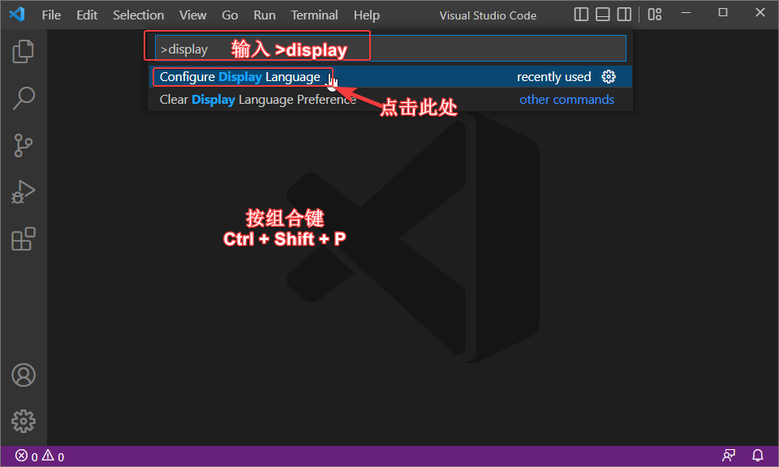
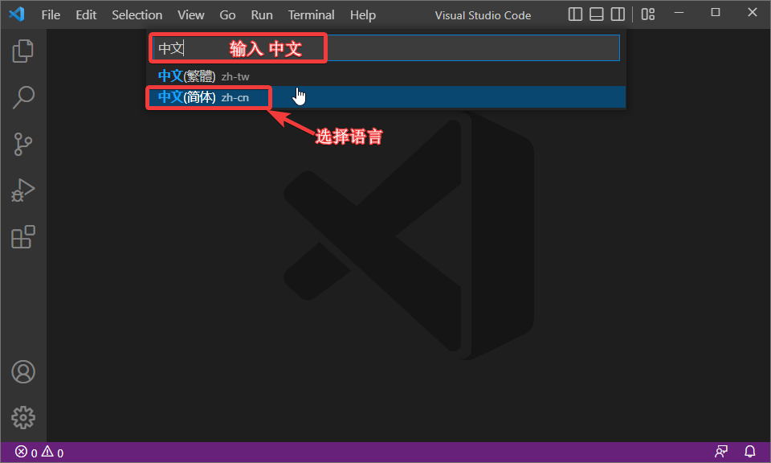
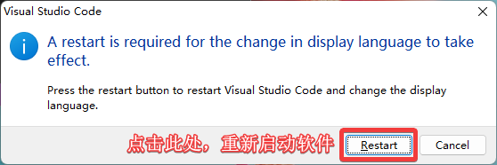
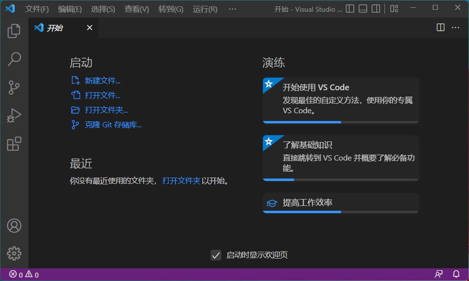

# 如何修改VSCode的显示语言

按组合键Ctrl+Shift+P呼叫控制台。输入 `>display`并且在下拉列表种选择 `Configure Display Language` 进行语言设置。

在新出现的窗口内输入 `中文`, 并且选择下拉列表种希望更换的语言选项。

点击 `Restart` 重启软件。

重启以后，软件的操作界面变成了中文。

## 其他
更多关于 `>display` 或者 `语言设置的信息` [请点这里](https://code.visualstudio.com/docs/getstarted/locales)。